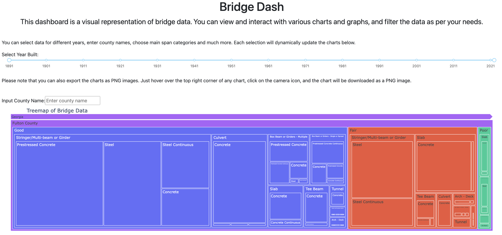
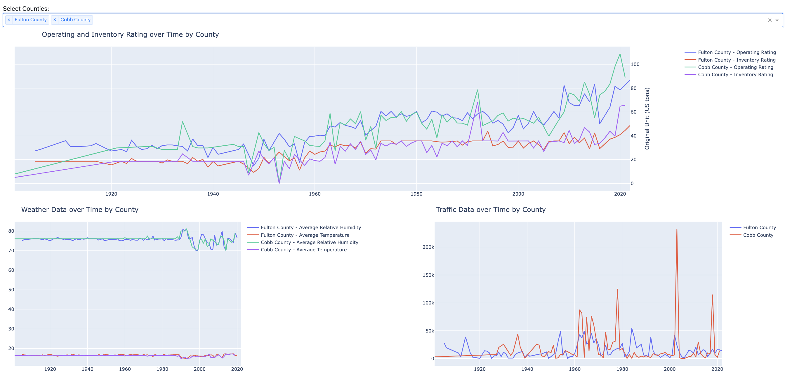
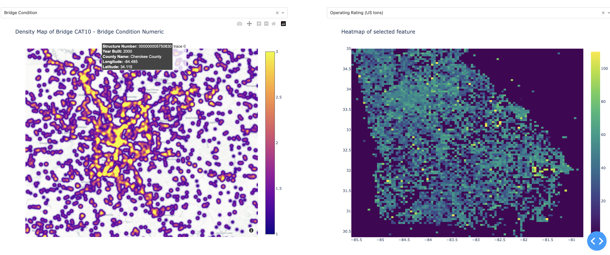
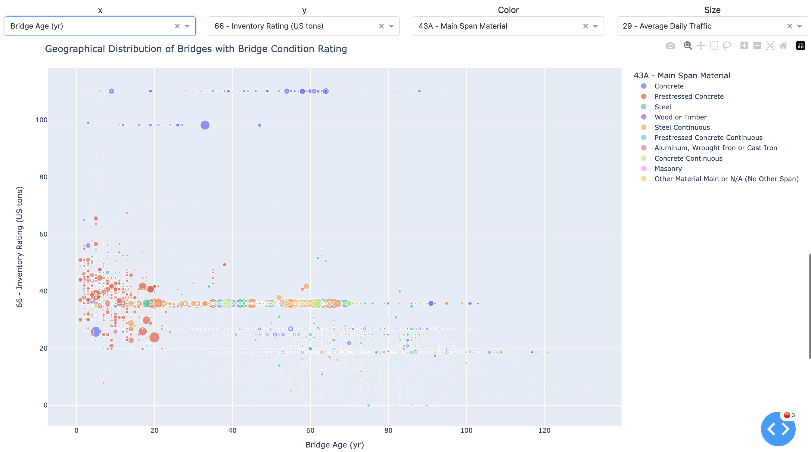

# bridge-dash Web Application

## Overview
BridgeDash is an interactive web application that provides insights into bridges' distribution, traffic patterns, condition ratings, and load-bearing across specified regions. This application enables users to understand various aspects of bridges including their geographical distribution, age, type, condition, traffic volumes, and much more.

## Features

### 1. Geographical Distribution and Physical Features
- Interactive map visualization of bridges
- Filters based on bridge types and age
- Visualization of bridge conditions geographically
- Identification of "Poor" condition bridge densities

### 2. Traffic Patterns
- Line chart of average daily traffic
- Identification of bottlenecks or high-traffic bridges
- Visualization of traffic pattern changes

### 3. Bridge Condition and Types
- Charts on overall condition ratings
- Analysis of most common bridge types
- Condition trends over time
- Clustering analysis based on condition, risk levels, or types

### 4. Load Bearing and Ratings
- Cumulative load-bearing statistics
- Scatter plots for load ratings vs. actual traffic loads
- Distribution of load ratings
- Comparative analysis of ratings based on materials

## Getting Started

### Prerequisites
- Python 3.7+
- Libraries: Dash, Plotly, Pandas, etc.

### Installation
Clone the repository and install the required dependencies:
```bash
git clone https://github.com/username/BridgeDash.git
cd BridgeDash
pip install -r requirements.txt
```

### Usage
Run the app locally:
```bash
python app.py
```
Navigate to `http://localhost:8050` in your web browser.

## Demo
The live demo of the application can be found [here](https://bridge-dash-90f35a395f88.herokuapp.com/).









## Documentation
Detailed documentation can be found in the `docs/` directory.

## Contributing
If you would like to contribute, please fork the repository and create a pull request. For major changes, please open an issue first to discuss what you would like to change.

## License
This project is licensed under the MIT License - see the [LICENSE.md](LICENSE.md) file for details.

## Acknowledgements
Special thanks to the team members, contributors, and everyone who helped in making this project a success.
